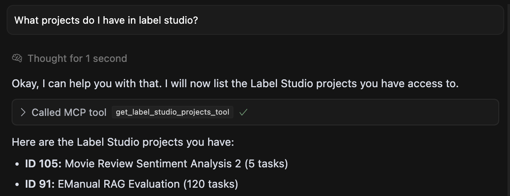

# Label Studio MCP Server

> **Fork notice:** This is a fork of the original
> [HumanSignal/label-studio-mcp-server](https://github.com/HumanSignal/label-studio-mcp-server),
> maintained by **DL-Solution**. It extends the upstream project with full Label
> Studio REST API coverage, an HTTP transport, `.mcpb` desktop-bundle packaging,
> and internal-CA / TLS support. Licensed under Apache-2.0; original copyright is
> retained in [`LICENSE`](./LICENSE).

## Overview

This project provides a Model Context Protocol (MCP) server that allows interaction with a [Label Studio](https://labelstud.io/) instance using the `label-studio-sdk`. It enables programmatic management of labeling projects, tasks, and predictions via natural language or structured calls from MCP clients. Using this MCP Server, you can make requests like: 

* "Create a project in label studio with this data ..." 
* "How many tasks are labeled in my RAG review project?" 
* "Add predictions for my tasks." 
* "Update my labeling template to include a comment box." 



## Features

The server exposes the full Label Studio REST API surface as MCP tools:

*   **Project Management**: Create, update, delete, list, validate configs, view details/configurations, and export projects.
*   **Task Management**: Create, update, delete, import, and list tasks; bulk-delete all tasks in a project.
*   **Annotation Management**: Create, read, update, delete, and list annotations for tasks.
*   **Prediction Integration**: Create, read, update, delete, and list model predictions.
*   **User Management**: Create, read, update, delete, list users, and resolve the current user (whoami).
*   **Workspace Management**: Create, read, update, delete, and list workspaces.
*   **Data Manager Views**: Create, read, update, delete, and list views (tabs), plus run bulk Data Manager actions.
*   **Comments**: Create, read, update, delete, and list annotation comments.
*   **Webhooks**: Create, read, update, delete, and list webhooks and inspect available webhook actions.
*   **ML Backends**: Connect, read, update, delete, list, and trigger training on ML backends.
*   **Instance Info**: Retrieve Label Studio version/build information.
*   **SDK Integration**: Leverages the official `label-studio-sdk` for communication.

## Prerequisites

1.  **Running Label Studio Instance:** You need a running instance of Label Studio accessible from where this MCP server will run.
2.  **API Key:** Obtain an API key from your user account settings in Label Studio.

## Configuration

The MCP server requires [the URL and API key for your Label Studio instance](https://labelstud.io/guide/access_tokens). If launching the server via an MCP client configuration file, you can specify the environment variables directly within the server definition. This is often preferred for client-managed servers.

Add the following JSON entry to your `claude_desktop_config.json` file or Cursor MCP settings:

```json
{
    "mcpServers": {
        "label-studio": {
            "command": "uvx",
            "args": [
                "--from",
                "git+https://github.com/HumanSignal/label-studio-mcp-server",
                "mcp-label-studio"
            ],
            "env": {
                "LABEL_STUDIO_API_KEY": "your_actual_api_key_here", // <-- Your API key
                "LABEL_STUDIO_URL": "http://localhost:8080"
            }
        }
    }
}
```

When configured this way the client launches the server as a local subprocess and
talks to it over **stdio** (the default transport). This is the simplest setup and
requires no open ports.

### Environment variables

| Variable | Required | Description |
| --- | --- | --- |
| `LABEL_STUDIO_API_KEY` | yes | Your Label Studio access token. |
| `LABEL_STUDIO_URL` | no | Base URL of the instance (default `http://localhost:8080`). Any reachable host works, e.g. an internal `https://ls.gkm-ua.local`. |
| `LABEL_STUDIO_CA_BUNDLE` | no | Path to a PEM file with the internal/corporate CA (e.g. an Active Directory CA) that issued the Label Studio **HTTPS** certificate. Needed so TLS verification succeeds for internally-issued certs. |
| `LABEL_STUDIO_VERIFY_SSL` | no | Set to `false` to disable TLS certificate verification entirely. Insecure — only for trusted internal networks or testing. Defaults to enabled. |

> **Internal / self-hosted over HTTPS:** the server bundles
> [`pip-system-certs`](https://pypi.org/project/pip-system-certs/), so it trusts
> the **operating system's certificate store** automatically. On a domain-joined
> machine this means an internal CA (e.g. an Active Directory CA whose root is
> already installed via group policy) is trusted out of the box — no extra
> configuration needed for `https://...gkm-ua.local`-style URLs.
>
> Use `LABEL_STUDIO_CA_BUNDLE` only when the issuing CA is **not** in the OS trust
> store — for example a plain Linux container, CI, or an Azure deployment that
> isn't domain-joined — by exporting the CA chain to a PEM file and pointing the
> variable at it. Plain **HTTP** needs no TLS configuration at all. In every case,
> make sure the host can resolve the internal hostname (DNS / domain membership).

### Install as a Desktop Extension (.mcpb)

Claude Desktop can install this server from a single **MCP Bundle** file
(`.mcpb`, formerly `.dxt`). Instead of hand-editing a JSON config, you double-click
the bundle and Claude Desktop shows a settings form for the Label Studio URL and
API key. This repository ships a [`manifest.json`](./manifest.json) that defines
that form (`user_config`) and runs the server through the `uv` runtime, so the
dependencies (including native ones) are managed automatically — no manual Python
setup required.

**Get the bundle:** a prebuilt `.mcpb` is attached to every tagged
[GitHub Release](https://github.com/HumanSignal/label-studio-mcp-server/releases)
(built automatically by the `release-mcpb` workflow). To build it yourself instead:

```bash
# One-time: install the bundler CLI
npm install -g @anthropic-ai/mcpb

# From the repository root
mcpb validate manifest.json     # optional sanity check
mcpb pack . dist/label-studio.mcpb
```

> **Versioning:** the version lives in both `manifest.json` and `pyproject.toml`.
> Bump them together with the helper script (never edit by hand):
>
> ```bash
> python scripts/bump_version.py patch     # or: minor | major | 1.4.2
> python scripts/bump_version.py --show     # print current version
> python scripts/bump_version.py --check    # verify the two files agree
> ```
>
> CI runs `--check` and fails on drift. Bumping the `version` (while keeping the
> manifest `name` and `author` unchanged) is what lets Claude Desktop recognise a
> reinstalled `.mcpb` as an **in-place update and preserve the entered settings**
> (URL / API key). Changing `name` or `author` creates a new extension identity
> and requires re-entering settings once.

> **Releasing:** the workflow checks that the pushed tag (`vX.Y.Z`) matches the
> `version` in `manifest.json`, so bump the version before tagging. To publish a
> **code-signed** bundle, add the repository secrets `MCPB_CERT_PEM` and
> `MCPB_KEY_PEM` (a PEM certificate that chains to a trusted root and its private
> key); the workflow then signs and verifies the bundle automatically. Without
> those secrets an unsigned — but fully functional — bundle is produced.

**Install it:**

1. Open **Claude Desktop → Settings → Extensions**.
2. Drag in (or open) the generated `dist/label-studio.mcpb` file.
3. Fill in **Label Studio URL** and **API Key** in the settings panel, then enable
   the extension.

The values you enter are injected into the server process as the
`LABEL_STUDIO_URL` and `LABEL_STUDIO_API_KEY` environment variables; the API key is
marked `sensitive`, so Claude Desktop masks it and stores it in the OS keychain.

### Running over HTTP

The server can also run as a network service over HTTP, which is useful when the
client and server live on different machines (or in different containers). Two
transports are available:

* `streamable-http` (recommended)
* `sse` (legacy, kept for backward compatibility)

Select the transport with the `--transport` flag (or the `MCP_TRANSPORT` env var)
and optionally configure the bind address and endpoint path:

| Flag | Env var | Default | Description |
| --- | --- | --- | --- |
| `--transport` | `MCP_TRANSPORT` | `stdio` | `stdio`, `streamable-http`, or `sse` |
| `--host` | `MCP_HOST` | `127.0.0.1` | Bind host for HTTP transports |
| `--port` | `MCP_PORT` | `8000` | Bind port for HTTP transports |
| `--path` | `MCP_PATH` | `/mcp` | URL path for the HTTP endpoint |

Start an HTTP server:

```bash
LABEL_STUDIO_API_KEY=your_actual_api_key_here \
LABEL_STUDIO_URL=http://localhost:8080 \
uvx --from git+https://github.com/HumanSignal/label-studio-mcp-server \
    mcp-label-studio --transport streamable-http --host 127.0.0.1 --port 8000
```

The MCP endpoint will then be available at `http://127.0.0.1:8000/mcp`.

> **Note:** The GitHub repository's visibility (public/private) is unrelated to the
> transport. HTTP works the same either way — you only need to make the server
> reachable on the network from wherever the client runs. Use `--host 0.0.0.0` to
> accept connections from other machines, and put it behind HTTPS + authentication
> if it is exposed beyond a trusted network.

#### Connect from VS Code

Add a `.vscode/mcp.json` file (or use the global MCP settings) pointing at the URL:

```json
{
    "servers": {
        "label-studio": {
            "type": "http",
            "url": "http://127.0.0.1:8000/mcp"
        }
    }
}
```

#### Connect from Claude Desktop

Claude Desktop connects to local servers over stdio (the `uvx` config above). To
connect it to a remote HTTP server, add the server as a Custom Connector from
**Settings → Connectors → Add custom connector** and provide the URL
(`http://127.0.0.1:8000/mcp`). Alternatively, bridge an HTTP endpoint to stdio with
[`mcp-remote`](https://www.npmjs.com/package/mcp-remote):

```json
{
    "mcpServers": {
        "label-studio": {
            "command": "npx",
            "args": ["mcp-remote", "http://127.0.0.1:8000/mcp"]
        }
    }
}
```

<!-- 
## Installation
Follow these instructions to install the server. 
```bash
git clone https://github.com/HumanSignal/label-studio-mcp-server.git 
cd label-studio-mcp-server

# Install dependencies using uv
uv venv
source .venv/bin/activate 
uv sync
```


    ```json
    {
      "mcpServers": {
        "label-studio": {
            "command": "uv",
            "args": [
                "--directory",
                "/path/to/your/label-studio-mcp-server", // <-- Update this path
                "run",
                "label-studio-mcp.py"
            ],
            "env": {
                "LABEL_STUDIO_API_KEY": "your_actual_api_key_here", // <-- Your API key
                "LABEL_STUDIO_URL": "http://localhost:8080"
            }
        }
      }
    }
    ```
    When configured this way, the `env` block injects the variables into the server process environment, and the script's `os.getenv()` calls will pick them up. -->

## Tools

The MCP server exposes the following tools. Each tool is annotated with MCP
behaviour hints (`readOnlyHint` / `destructiveHint`), so clients such as Claude
automatically group them in their permission UI into **Read-only tools** (all
`get_*` / `list_*` / `validate_*` / `export_*`), **Write/delete tools** (`create_*`,
`update_*`, `import_*`, `train_*`, and the `delete_*` / destructive actions).

### Project Management

*   **`get_label_studio_projects_tool()`**: Lists available projects (ID, title, task count).
*   **`get_label_studio_project_details_tool(project_id: int)`**: Retrieves detailed information for a specific project.
*   **`get_label_studio_project_config_tool(project_id: int)`**: Fetches the XML labeling configuration for a project.
*   **`create_label_studio_project_tool(title: str, label_config: str, ...)`**: Creates a new project with a title, XML config, and optional settings. Returns project details including a URL.
*   **`update_label_studio_project_tool(project_id: int, ...)`**: Updates project settings (title, description, config, annotation options, workspace, etc.). Only passed fields change.
*   **`update_label_studio_project_config_tool(project_id: int, new_label_config: str)`**: Updates the XML labeling configuration for an existing project.
*   **`validate_label_studio_project_config_tool(project_id: int, label_config: str)`**: Validates an XML config against a project without saving it.
*   **`delete_label_studio_project_tool(project_id: int)`**: Permanently deletes a project and all of its data.
*   **`export_label_studio_project_tasks_tool(project_id: int)`**: Exports the project's tasks and annotations as JSON.
*   **`list_label_studio_export_formats_tool(project_id: int)`**: Lists the export formats available for a project.

### Task Management

*   **`list_label_studio_project_tasks_tool(project_id: int)`**: Lists task IDs within a project (up to 50).
*   **`get_label_studio_task_data_tool(project_id: int, task_id: int)`**: Retrieves the data payload for a specific task.
*   **`get_label_studio_task_annotations_tool(project_id: int, task_id: int)`**: Fetches existing annotations for a specific task.
*   **`import_label_studio_project_tasks_tool(project_id: int, tasks_file_path: str)`**: Imports tasks from a JSON file (containing a list of task objects) into a project. Returns import summary and project URL.
*   **`create_label_studio_task_tool(project_id: int, data: Dict[str, Any])`**: Creates a single task with the given data payload.
*   **`update_label_studio_task_tool(task_id: int, data: Dict[str, Any], ...)`**: Updates a task's data payload (and optionally its project).
*   **`delete_label_studio_task_tool(task_id: int)`**: Deletes a single task and its annotations.
*   **`delete_all_label_studio_project_tasks_tool(project_id: int)`**: Deletes ALL tasks in a project (irreversible).

### Annotations

*   **`list_label_studio_task_annotations_tool(task_id: int)`**: Lists all annotations for a task (Annotations API).
*   **`get_label_studio_annotation_tool(annotation_id: int)`**: Retrieves a single annotation.
*   **`create_label_studio_annotation_tool(task_id: int, result: List[Dict[str, Any]], ...)`**: Creates an annotation for a task.
*   **`update_label_studio_annotation_tool(annotation_id: int, ...)`**: Updates an existing annotation.
*   **`delete_label_studio_annotation_tool(annotation_id: int)`**: Deletes an annotation.

### Predictions

*   **`create_label_studio_prediction_tool(task_id: int, result: List[Dict[str, Any]], ...)`**: Creates a prediction for a specific task. Requires the prediction result as a list of dictionaries matching the Label Studio format. Optional `model_version` and `score`.
*   **`list_label_studio_predictions_tool(task_id: int = None, project_id: int = None)`**: Lists predictions, optionally filtered by task and/or project.
*   **`get_label_studio_prediction_tool(prediction_id: int)`**: Retrieves a single prediction.
*   **`update_label_studio_prediction_tool(prediction_id: int, ...)`**: Updates an existing prediction.
*   **`delete_label_studio_prediction_tool(prediction_id: int)`**: Deletes a prediction.

### Users

*   **`list_label_studio_users_tool()`**: Lists all users.
*   **`get_label_studio_user_tool(user_id: int)`**: Retrieves a single user.
*   **`get_label_studio_current_user_tool()`**: Returns the currently authenticated user (whoami).
*   **`create_label_studio_user_tool(email: str, ...)`**: Creates a new user.
*   **`update_label_studio_user_tool(user_id: int, ...)`**: Updates a user's profile.
*   **`delete_label_studio_user_tool(user_id: int)`**: Deletes a user.

### Workspaces

*   **`list_label_studio_workspaces_tool()`**: Lists all workspaces.
*   **`get_label_studio_workspace_tool(workspace_id: int)`**: Retrieves a single workspace.
*   **`create_label_studio_workspace_tool(title: str, ...)`**: Creates a workspace.
*   **`update_label_studio_workspace_tool(workspace_id: int, ...)`**: Updates a workspace.
*   **`delete_label_studio_workspace_tool(workspace_id: int)`**: Deletes a workspace.

### Data Manager Views & Actions

*   **`list_label_studio_views_tool(project_id: int = None)`**: Lists Data Manager views (tabs).
*   **`get_label_studio_view_tool(view_id: int)`**: Retrieves a single view.
*   **`create_label_studio_view_tool(project_id: int, data: Dict[str, Any] = None)`**: Creates a view with optional filters/ordering.
*   **`update_label_studio_view_tool(view_id: int, ...)`**: Updates a view.
*   **`delete_label_studio_view_tool(view_id: int)`**: Deletes a view.
*   **`run_label_studio_action_tool(action_id: str, project_id: int, ...)`**: Runs a bulk Data Manager action (e.g. `delete_tasks`, `predictions_to_annotations`, `remove_duplicates`).

### Comments

*   **`list_label_studio_comments_tool(project_id: int = None, annotation_id: int = None)`**: Lists comments.
*   **`get_label_studio_comment_tool(comment_id: int)`**: Retrieves a single comment.
*   **`create_label_studio_comment_tool(annotation_id: int, text: str, ...)`**: Creates a comment on an annotation.
*   **`update_label_studio_comment_tool(comment_id: int, ...)`**: Updates a comment.
*   **`delete_label_studio_comment_tool(comment_id: int)`**: Deletes a comment.

### Webhooks

*   **`list_label_studio_webhooks_tool(project_id: int = None)`**: Lists webhooks.
*   **`get_label_studio_webhook_tool(webhook_id: int)`**: Retrieves a single webhook.
*   **`create_label_studio_webhook_tool(url: str, ...)`**: Creates a webhook.
*   **`update_label_studio_webhook_tool(webhook_id: int, url: str, ...)`**: Updates a webhook.
*   **`delete_label_studio_webhook_tool(webhook_id: int)`**: Deletes a webhook.
*   **`get_label_studio_webhook_actions_tool()`**: Lists the available webhook actions/events.

### ML Backends

*   **`list_label_studio_ml_backends_tool(project_id: int = None)`**: Lists connected ML backends.
*   **`get_label_studio_ml_backend_tool(ml_backend_id: int)`**: Retrieves a single ML backend.
*   **`create_label_studio_ml_backend_tool(url: str, project: int, ...)`**: Connects a new ML backend to a project.
*   **`update_label_studio_ml_backend_tool(ml_backend_id: int, ...)`**: Updates an ML backend.
*   **`delete_label_studio_ml_backend_tool(ml_backend_id: int)`**: Disconnects an ML backend.
*   **`train_label_studio_ml_backend_tool(ml_backend_id: int, ...)`**: Triggers a training run on an ML backend.

### Instance Info

*   **`get_label_studio_version_tool()`**: Returns version/build information for the Label Studio instance.

## Example Use Case

1.  Create a new project using `create_label_studio_project_tool`.
2.  Prepare a JSON file (`tasks.json`) with task data.
3.  Import tasks using `import_label_studio_project_tasks_tool`, providing the project ID from step 1 and the path to `tasks.json`.
4.  List task IDs using `list_label_studio_project_tasks_tool`.
5.  Get data for a specific task using `get_label_studio_task_data_tool`.
6.  Generate a prediction result structure (list of dicts).
7.  Add the prediction using `create_label_studio_prediction_tool`.


## Contact

For questions or support, reach out via [GitHub Issues](https://github.com/HumanSignal/label-studio-mcp-server/issues).
